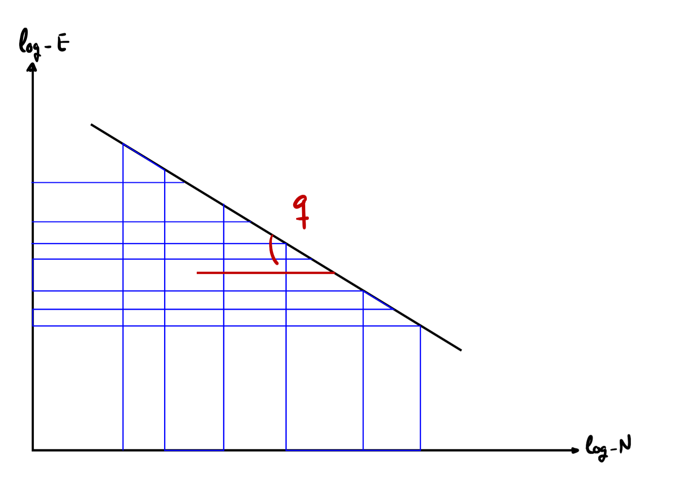

# M3: Richardson

Asignatura: AM1
Fecha de Clase: 24/10/2024

## Metodología para aprender código':'

1. Xtreme programming
    - Driver
    - Reviewer
2. TDD  (Test Driven Development)
3. Top Down
    - Consiste en agarrar un problea gordo (top), y seleccionar las partes mas pequeñas e ir desarrollando (down)

        ```mermaid
        graph TD
            A["Top-Down Approach"]
            A --> B["Problem Gordo (Top)"]
            B --> C["Seleccionar Partes Pequeñas"]
            C --> D["Desarrollar Parte 1"]
            C --> E["Desarrollar Parte 2"]
            C --> F["Desarrollar Parte 3"]
            D --> G["Solución Final (Down)"]
            E --> G
            F --> G
        
        %% Notas:
        %% - El enfoque Top-Down comienza con un problema grande
        %% - Se descompone en partes más pequeñas y manejables
        %% - Cada parte se desarrolla individualmente
        %% - Las soluciones de las partes se combinan para resolver el problema original
        ```

    Este diagrama ilustra el enfoque Top-Down mencionado en tus apuntes. Comienza con el "problema gordo" en la parte superior y muestra cómo se descompone en partes más pequeñas para su desarrollo. Finalmente, estas partes convergen en la solución final en la parte inferior del diagrama, representando el proceso "down".

## METODO DE RICHARDSON

Este diagrama ilustra el proceso del método de Richardson (extrapolación) para mejorar la precisión de una solución numérica. Muestra cómo se calculan dos estimaciones con diferentes tamaños de paso, cómo se combinan estas estimaciones para eliminar el error principal, y cómo esto resulta en una solución final mejorada.

```mermaid
graph TD
    A["Método de Richardson (Extrapolación)"]
    A --> B["Cauchy"]
    A --> C["Mesh"]
    B --> D["Temporal schemes"]
    D --> E["Newton"]

%% Notas:
%% - El método de Richardson usa dos estimaciones con diferentes tamaños de paso
%% - Las estimaciones se combinan para reducir errores
%% - El resultado es una aproximación más precisa de la solución real
```

Si yo llamo a Richardson conozco el error, con distintas llamadas a Richardson calculo el grafico:



## NEWTON


Sacamos la ecuación de la recta:

$$
y=f'(x_n)(x-x_n)+f(x_n)
$$

$$
y=0=f'(x_n)(x_{n+1} + x_n)+f(x_n)
$$

$$
x_{n+1} = x_n - \frac{f(x_n)}{f'(x_n)}
$$

## CÓDIGO CLASE

```python
from numpy import array, zeros, linspace, concatenate, pi
from numpy.linalg import norm
import matplotlib.pyplot as plt
from scipy.optimize import newton

# linspace = secuencias de valores espaciados uniformemente
# concatenate = ara unir arrays o matrices, ya sea en forma horizontal o 
# vertical

#Problema físico

def Kepler(U, t): # U = vector espacio y velocidad(4 componentes en 2D)
   
   r = U[0:2] # r ocupa las posiciones 1 y 2 de U
   rdot = U[2:4] # rdot ocupa las posiciones 3 y 4 de U
   # F = U'
   F = concatenate( (rdot,-r/norm(r)**3), axis=0)
   
   return F

#Esquemas numéricos

def Euler(F , U, dt, t):
    
    return U + dt * F(U,t)

def Euler_Implicito(F, U, dt, t): #tambien se le dice Euler inverso

    def G(X):
        return X - U - dt*F(X,t)
    
    return newton(G, U)  # Utiliza como punto inicial el valor de la solución en el instante anterior

def RungeKutta4(F, U, dt, t):
 
    k1 = F(U, t)
    k2 = F(U + dt * k1/2, t + dt/2)
    k3 = F(U + dt * k2/2, t + dt/2)
    k4 = F(U + dt * k3, t + dt)
    
    return U + (dt/6) * (k1 + 2*k2 + 2*k3 + k4)

def Crank_Nicolson(F, U, dt, t):

    def G(X):
        return X - U - dt/2* ( F(U,t) + F(X,t) )
    
    return newton(G, U)

# Vector de estado inicial para resolver Kepler
U_0 = array( [ 1, 0, 0, 1 ])

# Vectores que guardan los valores 
# x = array( zeros(N) )
# y = array( zeros(N) )
# vx = array( zeros(N) )
# vy = array( zeros(N) )
# t = array( zeros(N) )

# Condiciones iniciales
# x[0] = U[0] 
# y[0] = U[1]
# vx[0] = U[2]
# vy = U[3]

# t_0 = 0
# t_f = 7
# N = 500
# t = linspace( t_0, t_f, N)

# U = zeros([N+1, 4])
# U[0,:] = U_0

#Problema de Cauchy

def Cauchy(F, Esquema, U_0, t):
    
    N = len(t)-1
    U = zeros((N+1, len(U_0)))

    U[0,:] = U_0
    for n in range(0,N):
        U[n+1,:] = Esquema( F, U[n,:], t[n+1]-t[n], t[n] )

    return U 

#####refinar malla
"""
Dada la particion t_1 con N+1 'puntos' obtiene la particion de t_2 que tiene con 2N+1 'puntos'
Los nodos pares en t_2 seguiran siendo los mismo de t_1, los impares seran 
los puntos medios de los pares
"""

def refinar_malla( t_1):
    
    N = len(t_1)-1
    t_2 = zeros(2*N+1)
    
    for i in range(0,N):

        t_2[2*i] = t_1[i] #pares
        t_2[2*i+1] = (t_1[i+1] + t_1[i])/2 #impares
        
    t_2[2*N] = t_1[N]
    
    return t_2

"""
 Hace una particion equiespaciada en N trozos de un segmento de la recta 
 real entre a y b
"""

def particion( a, b, N):
    
    t = zeros(N+1)
     
    for i in range(0, N+1):
        
        t[i] = a + (b-a)/N * i
    
    return t

# metodo de richarson

def Cauchy_Error( F, Esquema, U_0, t):
    
    N = len(t)-1
    a = t[0]
    b = t[N]
    Error = zeros((N+1, len(U_0)))
    t_1 = t
    t_2 = particion( a, b, 2*N)
    
    U_1 = Cauchy(F, Esquema, U_0, t_1) 
    U_2 = Cauchy(F, Esquema, U_0, t_2)
    
    
    for i in range(0,N+1):
        
        Error[i,:] = U_2[2*i,:] - U_1[i,:]

    return U_1, Error

# Problema de Oscilador armónico: xdot2 + x = 0. 

def Oscilador(U, t):

    x = U[0]
    xdot = U[1]
    F = array( [xdot, -x] )

    return F

t_1 = particion( a=0, b=8*pi, N=1000) 

U_1, Error = Cauchy_Error( F = Oscilador, Esquema=Euler_Implicito, U_0=array([1, 0]), t=t_1)
plt.plot( t_1, U_1[:,0])
# plt.show()

plt.plot( t_1, Error[:,0])
plt.show()

# a, b = 0., 1.
# N = 5

# t = linspace( a, b, N+1)
# print(t)

# t_1 = particion( a, b, N)
# print(t_1)

# t_2 = refinar_malla( t_1)
# print(t_2)

# t_2 = particion( a, b, 2*N)
# print(t_2)

# Grafico que sea el log del Error y el Log de N
# debe salir una recta con pendiente negativa  
